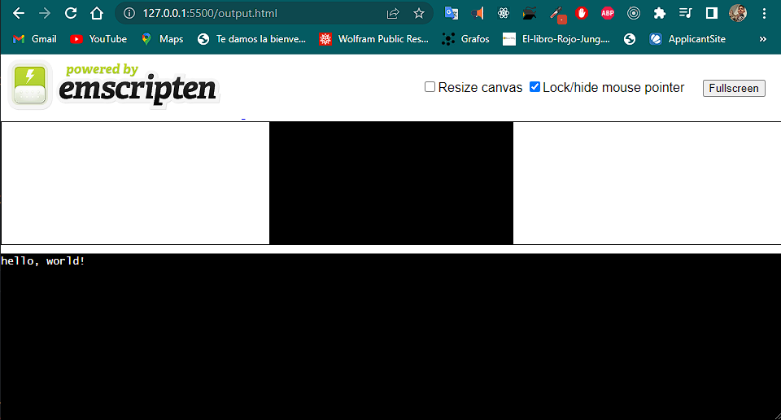

* 2/20/27 @ CDMX/México.
* @author  @AlexisTercero55
* @github  https://github.com/AlexisTercero55
* @mail    alexistercero55@gmail.com
* LICENSE MPL-2.0

---
# C to WebAssembly

## Powered by [Emscripten ](https://emscripten.org/index.html)

> Emscripten is a complete compiler toolchain to WebAssembly, using LLVM, with a special focus on speed, size, and the Web platform.

## Installation process

See [Download and install](https://emscripten.org/docs/getting_started/downloads.html)

## Compile with ``emcc``

    emcc .\test.c -s WASM=1 -o output.html

## Relevant resources

* [Emscripten Tutorial](https://emscripten.org/docs/getting_started/Tutorial.html#tutorial)
* [Compile C Language Into WebAssembly](https://www.youtube.com/watch?v=_pHgILVlx3c&t=328s)

